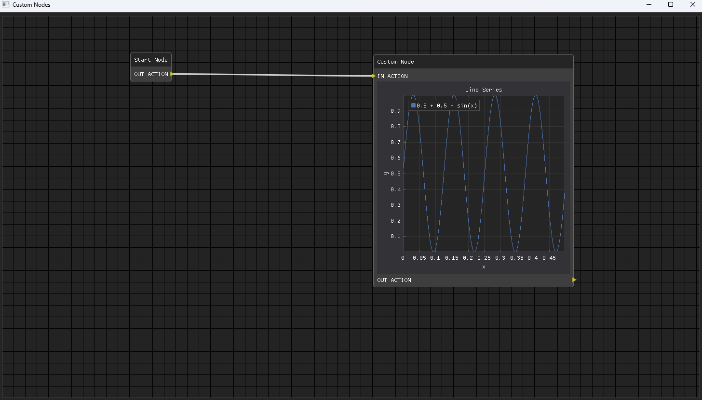

# dpgnodes

A library that allows you to make a code editor on the basis of Node Editor. It is possible to add custom nodes, with their own code, which they will execute.

## Installing
```
pip install git+https://github.com/Lorg0n/dpgnodes-lib/
```

## Usage
```python
import math

import dearpygui.dearpygui as dpg
import dpgnodes as nodes

dpg.create_context()


class CustomNode(nodes.Node):
    LABEL_NAME = "Custom Node"
    CATEGORY_NAME = "Customs"

    def __init__(self, node_list: [], link_list: [], parent=None):
        super().__init__(self.CATEGORY_NAME, self.LABEL_NAME, parent, node_list, link_list)
        self.create()
        node_list.append(self)

    def create(self):
        self.input_action_attribute()

        sindatax = []
        sindatay = []
        for i in range(0, 500):
            sindatax.append(i / 1000)
            sindatay.append(0.5 + 0.5 * math.sin(50 * i / 1000))
        
        with dpg.node_attribute(attribute_type=dpg.mvNode_Attr_Static, parent=self.tag) as attr:
            with dpg.plot(label="Line Series", height=400, width=400):
                dpg.add_plot_legend()
                dpg.add_plot_axis(dpg.mvXAxis, label="x")
                dpg.add_plot_axis(dpg.mvYAxis, label="y", tag="y_axis")
                dpg.add_line_series(sindatax, sindatay, label="0.5 + 0.5 * sin(x)", parent="y_axis")

        self.output_action_attribute()

    def eval(self):
        print('WOW!')


with dpg.window(tag="Primary Window"):
    nodes.code_node_editor()

dpg.create_viewport(title='Custom Nodes', width=600, height=200)
dpg.setup_dearpygui()
dpg.show_viewport()
dpg.set_primary_window("Primary Window", True)
dpg.start_dearpygui()
dpg.destroy_context()
```



## Description
A library that allows you to make a code editor on the basis of Node Editor. It is possible to add custom nodes, with their own code, which they will execute. All this is based on the main [DearPyGui](https://dearpygui.readthedocs.io/en/latest/index.html) library

- All functionality of the Dear PyGui main library has been retained
- It is possible to create custom nodes
- Built-in tool for launching your programme
